class: middle, center, title-slide

# Дослідження і проектування інтелектуальних систем

Лекція 1: Вступ

  
Кочура Юрій Петрович 
[iuriy.kochura@gmail.com](mailto:iuriy.kochura@gmail.com)  
<a href="https://t.me/y_kochura">@y_kochura</a>  

---

# Сьогодні

- Інтелект vs штучний інтелект
- Визначення штучного інтелекту та парадигма
- Типи машинного навчання
- Концепція глибинного навчання
- Приклади застосування глибинного навчання
- Перцептрон: пряме та зворотне поширення
- Загальні функції активації

---

class: blue-slide, middle, center
count: false

.larger-xx[Штучний інтелект]

---

class: middle

# Чи може машина думати?
.grid[
.kol-2-3[
.width-90[]

.pull-right[&mdash; Alan Turing, 1950]
]

.kol-1-3[.center.circle.width-70[]

.center.smaller-xxx[Image source: [biography](https://www.biography.com/scientist/alan-turing)]
  ]
]

.footnote[Credits: [Alan Turing](https://academic.oup.com/mind/article/LIX/236/433/986238), 1950.]

???

Що таке свідомість?
Чи можуть машини думати?

Британський науковець Алан Тюрінг задавався питанням
чи може комп'ютер розмовляти, як людина?

Це запитання призвело до ідеї оцінки штучного інтелекту, що, як відомо, втілилося у відомому тесті Тюрінга. У 1950 році в статті "Обчислювальна техніка та інтелект" Тюрінг запропонував наступну гру.
Суддя-людина переписується з учасниками (гравцями), яких він не бачить, та оцінює їхні відповіді. Щоб пройти тест, комп'ютер повинен бути у змозі підмінити одного з учасників, не помітивши підміни. Іншими словами, комп'ютер вважатиметься розумним, якщо його розмову неможливо буде легко відрізнити від людської.

---

class: middle
count: false

.smaller-x.italic[
In the process of trying to imitate an adult human mind we are bound to think a good deal about
the process which has brought it to the state that it is in. We may notice three components,

  a. The initial state of the mind, say at birth,

  b. The education to which it has been subjected,

  c. Other experience, not to be described as education, to which it has been subjected.

Instead of trying to produce a programme to simulate the adult mind, why not rather try to produce
one which simulates the child’s? If this were then subjected to an appropriate course of education one
would obtain the adult brain. Presumably the child-brain is something like a note-book as one buys
it from the stationers. Rather little mechanism, and lots of blank sheets. (Mechanism and writing
are from our point of view almost synonymous.) Our hope is that there is so little mechanism in
the child-brain that something like it can be easily programmed.

]

.pull-right[&mdash; Alan Turing, 1950]

.footnote[Credits: [Alan Turing](https://academic.oup.com/mind/article/LIX/236/433/986238), 1950.]

???

Намагаючись імітувати розум дорослої людини, ми зобов’язані багато думати про процес, який привів його до стану, в якому він перебуває. Ми можемо помітити три компоненти:

a. Початковий стан розуму, скажімо, при народженні

b. Освіта, якій людина була піддана,

в. Інший досвід, який не можна назвати навчанням, якому він був підданий.

Замість того, щоб намагатися створити програму для моделювання розуму дорослого, чому б не спробувати створити таку, яка моделює розум дитини? Якби це потім було піддано відповідному курсу освіти, можна було б отримати дорослий мозок. Імовірно, дитячий мозок — це щось на кшталт зошита, оскільки його купують у канцтоварах. Досить маленький механізм і багато чистих аркушів. (Механізм і письмо з нашої точки зору майже синоніми.) Ми сподіваємось, що в дитячому мозку настільки мало механізмів, що щось подібне можна легко запрограмувати.

---

class: middle

# Що таке інтелект?

- Інтелект &mdash; це про здатність

.bold.center.larger-x[навчатися приймати рішення для досягнення цілей]
   

- Навчання, прийняття рішення, та цілі є ключовими

---

class: middle

# Що таке штучний інтелект?

- У широкому сенсі 

.bold.larger-x[Будь-яка техніка, яка дозволяє комп'ютерам імітувати поведінку людини]
   
---

class: middle

# Що таке штучний інтелект?

- У вузькому сенсі 

.alert[
.bold.larger-x[**Штучний інтелект** &mdash; здатність інженерної системи обробляти, застосовувати та вдосконалювати здобуті знання та вміння.]]

- **Знання** &mdash; це факти, інформація та навички, набуті через досвід або навчання.

.footnote[Credits: [ISO/IEC TR 24028:2020(en)](https://www.iso.org/obp/ui/#iso:std:iso-iec:tr:24028:ed-1:v1:en:term:3.4), 2020.]

---

class: middle

## Коротка історія

.smaller-xx[
- 1940—1952: Early days
  - 1943: McCulloch & Pitts: Boolean circuit model of brain
  - 1950: Turing's ''Computing Machinery and Intelligence''

- 1952–1956:  The birth of AI
  - 1950s: Early AI programs, including Samuel's checkers program,
Newell & Simon's Logic Theorist, Gelernter's Geometry Engine
  - 1956: Dartmouth meeting: ''Artificial Intelligence'' adopted

- 1956–1974: The golden years 
  - 1958: Frank Rosenblatt invented [perceptron](https://en.wikipedia.org/wiki/Perceptron) (simple neural network)
  - 1964: [Bobrow's program](https://en.wikipedia.org/wiki/STUDENT_(computer_program) that solves algebra word problems
  - 1965: Robinson's complete algorithm for logical reasoning

- 1974–1980: The first AI winter

- 1980–1987: Expert systems industry boom
- 1987—1993: Expert systems industry busts: the second AI winter 

- 1993–2011: Statistical approaches 
  - Resurgence of probability, focus on uncertainty
  - General increase in technical depth
  - Intelligent agents

- 2011–present: Deep Learning, Big Data and AI
  - Big data, big compute, neural networks
  - AI used in many industries
]

.footnote[Credits: [Wikipedia - History of artificial intelligence](https://en.wikipedia.org/wiki/History_of_artificial_intelligence#Deep_learning)]

---

class: middle

# AI &mdash; багата галузь

.center.width-90[]

.footnote[Image Source: [Marizel B. and Ma. Louella Salenga](https://www.researchgate.net/publication/324183626_Bitter_Melon_Crop_Yield_Prediction_using_Machine_Learning_Algorithm), 2018.]

---

class: middle

.center.width-90[]

.footnote[Image Source: [Why you Might Want to use Machine Learning](https://ml-ops.org/content/motivation).]

---

class: middle

.center.width-50[]

"Just as electricity transformed almost everything 100 years ago, today I actually have a hard time thinking of an industry that I don't think AI will transform in the next several years."

.pull-right[&mdash; Andrew Ng]

.footnote[Credits: [Andrew Ng: Artificial Intelligence is the New Electricity](https://www.youtube.com/watch?v=21EiKfQYZXc), 2017.]

---

class: blue-slide, middle, center
count: false

.larger-xx[Машинне навчання]

---

class: middle, center

# Що таке машинне навчання?

---

class: middle

# Визначення за Артур Семюель

.center[
.width-100[]
]

---

class: middle

# Визначення за Том Мітчелл

Том Мітчелл (1998): Комп’ютерна програма, яка учиться з досвiду **E** по вiдношенню до деякого
класу задач **T** та мiри продуктивностi **P** називається машинним навчанням, якщо її продуктивнiсть у задачах
з **T**, що вимiрюється за допомогою **P**, покращується з досвiдом **E**.

.right[
.width-30[]
]

  - Досвід (дані): ігри в які грає програма сама з собою
  - Вимір продуктивності: коефіцієнт виграшу

---

class: middle

# Класичне програмуванн vs машинне навчання

.center[
.width-100[]
]

???

Комп’ютери та обчислення допомагають нам досягати бiльш складних цiлей i кращих результатiв у вирiшеннi
проблем, нiж ми могли б досягти самi. Однак, багато сучасних завдань вийшли за рамки обчислень через один
основний обмежуючий фактор: традицiйно, комп’ютери можуть дотримуватися лише конкретних
вказiвок/iнструкцiй, якi їм дають.

Вирiшення проблем з програмування вимагає написання конкретних покрокових iнструкцiй, якi має виконувати комп’ютер. Ми називаємо цi кроки алгоритмами. У цьому випадку, комп’ютери можуть допомогти нам
там, де ми:
1. Розумiємо як вирiшити проблему.
2. Можемо описати проблему за допомогою чiтких покрокових iнструкцiй, якi комп’ютер може зрозумiти.

---

class: middle
count: false

# Класичне програмуванн vs машинне навчання

.center[
.width-100[]
]

???

Методи машинного навчання дозволяють комп’ютерам “учитися” на прикладах. Вирiшення проблем iз застосуванням машинного навчання вимагає виявлення деякого шаблону, а потiм, коли такий шаблон готовий, дозволяють, наприклад, нейроннiй мережi вивчити карту переходiв мiж вхiдними та вихiдними даними. Ця особливiсть вiдкриває новi типи проблем, де комп’ютери можуть допомогти нам у їх розв’язаннi, за умови, коли ми:
1. Визначили шаблон проблеми.
2. Маємо достатньо даних, що iлюструють шаблон.
---

class: middle

# Типи навчання

За характером навчальних даних (**досвiду**) машинне навчання подiляють на чотири типи: контрольоване (з учителем), напiвконтрольоване, неконтрольоване (без учителя) та з пiдкрiпленням.

.center[
.width-100[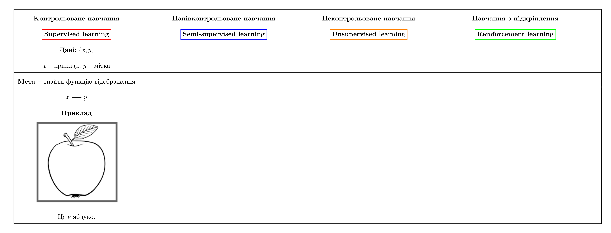]
]

---

class: middle
count: false

# Типи навчання

.center[
.width-100[]
]

---

class: middle
count: false

# Типи навчання

.center[
.width-100[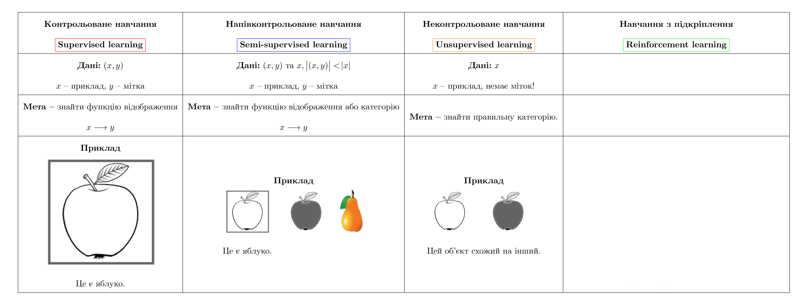]
]

---

class: middle
count: false

# Типи навчання

.center[
.width-100[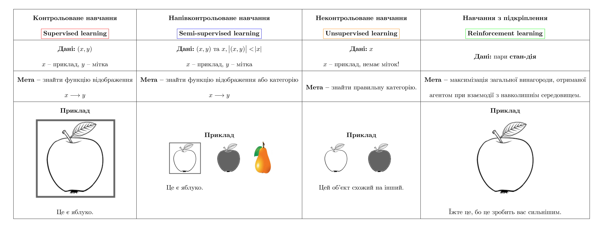]
]

---

class: middle

# Як вчиться людина?

- Ми та інші розумні істоти, вчимось завдяки **взаємодії із своїм оточенням**

- Взаємодії часто бувають **послідовними** - майбутні взаємодії можуть залежати від попередніх

- Ми направлені на **результат**

- Ми можемо вчитися **не маючи прикладів** оптимальної поведінки

???

Нейронні мережі, прекрасна біологічно натхненна парадигма програмування, яка дозволяє комп’ютеру навчатися на основі даних спостережень

---

class: middle

# Мозок людини

Базовою обчислювальною одиницею мозку є нейрон. Мозок дорослої людини складається з $86$ мiльярдiв нейронiв, якi з’єднанi між собою приблизно
$10^{14}$ − $10^{15}$ синапсами.

.footnote[Джерело: [F. A. Azevedo та ін.](https://onlinelibrary.wiley.com/doi/abs/10.1002/cne.21974), 2009.]

---

class: middle

# Біологічний та штучний нейрон

.center[
.width-100[]
]

---

class: middle,
# Деякі функції активації

.center[
.width-100[]
]

---

class: middle

# Людина добре сприймати візуальну інформацію

---

class: middle, center

.width-100[]

Що Ви бачите?

???

.italic[Як Ви це робите?]

---

class: middle

.center[
.width-70[]

Собака-вівця чи швабра?
]

---

class: middle

Людський мозок настільки добре інтерпретує візуальну інформацію, що **розрив** між зображенням та його семантичною інтерпретацією (пікселями) важко оцінити інтуїтивно: 

 
.center[

Це мухомор.
]

---

class: middle, center

.width-70[]

Це мухомор.

---

class: middle, center

.width-30[] +
.width-30[] +
.width-30[]

Це мухомор.

---

class: middle, center

.width-80[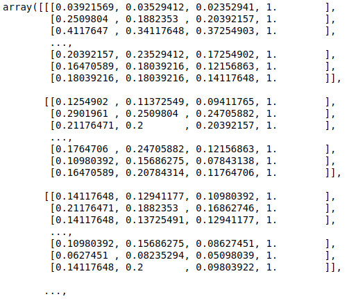]

Це мухомор.

---

class: middle, center

# Як навчить машин бачити?

---

class: middle

.center.width-60[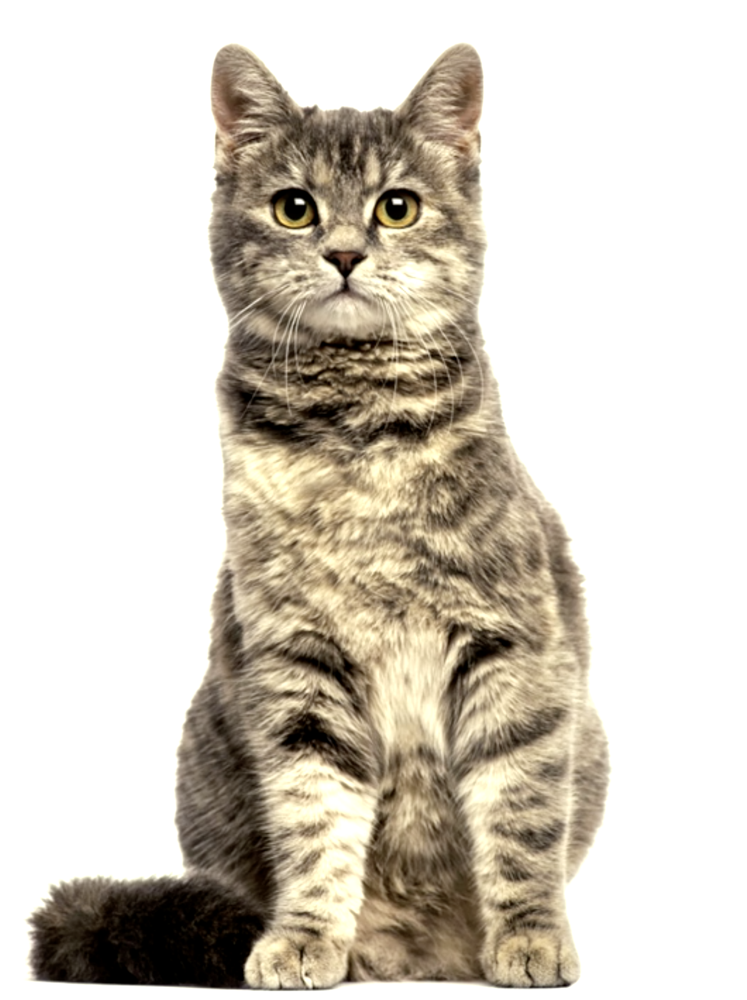]

---

count: false
class: black-slide

.center.width-60[]

---

count: false
class: black-slide, middle

.center.width-80[]

---

count: false
class: black-slide, middle

.center.width-80[]

---

class: middle

Для пошуку шаблону в даних (витягування семантичної інформації, ознак) потрібна побудова **складних моделей**, які б отримати вручну було б дуже складно.

Однак, можна написати програму, яка буде **вчитись** знаходити шаблон в даних самостійно. 

---

class: middle

.center.width-100[]

---

class: middle

# Що входить до задачі машинного навчання?

- Постановка проблеми + дані
- Навчання моделі
- Визначення функції втрат
- Вибір алгоритму оптимізації

---

class: middle

# Які дані використовуються?

.center.width-100[]

---

class: middle

# Ознаки у машинному навчанні

Ознаки - це спостереження, які використовуються для прийняття рішень моделлю.

- Для класифікації зображень **кожен** піксель є ознакою
- Для розпізнавання голосу, **частота** та **гучність** є ознаками
- Для безпілотних автомобілів дані з **камер**, **радарів** і **GPS** є ознаками

---

class: middle

# Типи ознак у робототехніці

- Пікселі (RGB дані)
- Глибина (сонар, лазерні далекоміри)
- Орієнтація або прискорення (гіроскоп, акселерометр, компас)

---

class: middle

# Недонавчання vs перенавчання

.center.width-100[]

---

class: middle
count: false

# Недонавчання vs перенавчання

.center.width-80[]

---

class: middle

# Що таке модель?

Хоча те, що знаходиться всерединi глибинної нейронної мережi, може бути складним, за своєю суттю це просто функцiї. Вони беруть певнi вхiднi данi: **INPUT x** i
генерують деякi вихiднi данi: **OUTPUT f(x)**

.center.width-30[]

---

# З чого складається модель?

.center.width-100[]

---

# Джерела помилок моделі

- Зсув  (Bias)
- Розкид (Variance)
- Шум (Irreducible error)

$$Err = Bias^2 + Variance + Irreducible error$$

.center.width-70[]

---

# Інтуїція

  
.center.width-55[]

---

class: blue-slide, middle, center
count: false

.larger-xx[Облсті застосування та успіхи ШІ]

---

class: middle, center, black-slide

<iframe width="600" height="450" src="https://www.youtube.com/embed/5kpsZoKjPgQ" frameborder="0" allowfullscreen></iframe>

Object detection, pose estimation, segmentation (2019)

---

class: middle, center, black-slide

<iframe width="600" height="450" src="https://www.youtube.com/embed/V1eYniJ0Rnk" frameborder="0" allowfullscreen></iframe>

Reinforcement learning (Mnih et al, 2014)

---

class: middle, center, black-slide

<iframe width="600" height="450" src="https://www.youtube.com/embed/qhUvQiKec2U" frameborder="0" allowfullscreen></iframe>

Autonomous cars (NVIDIA, 2016)

---

class: middle, center, black-slide

<iframe width="600" height="450" src="https://www.youtube.com/embed/tlThdr3O5Qo" frameborder="0" allowfullscreen></iframe>

Autopilot (Tesla, 2019)

???

A full build of Autopilot neural networks involves 48 networks that take 70,000 GPU hours to train 🔥. Together, they output 1,000 distinct tensors (predictions) at each timestep.

---

class: middle, center, black-slide

<iframe width="600" height="450" src="https://www.youtube.com/embed/hA_-MkU0Nfw" frameborder="0" allowfullscreen></iframe>

Autonomous cars (Waymo, 2022)

---

class: middle, black-slide

.center[
<video loop controls preload="auto" height="400" width="600">
  <source src="./figures/lec1/physics-simulation.mp4" type="video/mp4">
</video>

Physics simulation (Sanchez-Gonzalez et al, 2020)

]

---

class: middle, black-slide, center

<iframe width="600" height="450" src="https://www.youtube.com/embed/gg7WjuFs8F4" frameborder="0" allowfullscreen></iframe>

AI for Science (Deepmind, AlphaFold, 2020)

---

class: middle, center, black-slide

<iframe width="600" height="450" src="https://www.youtube.com/embed/7gh6_U7Nfjs" frameborder="0" allowfullscreen></iframe>

Speech synthesis and question answering (Google, 2018)

---

class: middle, center, black-slide

<iframe width="600" height="450" src="https://www.youtube.com/embed/kSLJriaOumA" frameborder="0" allowfullscreen></iframe>

Image generation (Karras et al, 2018)

---

class: middle, center, black-slide

<iframe width="600" height="450" src="https://www.youtube.com/embed/qTgPSKKjfVg" frameborder="0" allowfullscreen></iframe>

Image generation and AI art (OpenAI, 2022)

---

class: middle, center, black-slide

<iframe width="600" height="450" src="https://www.youtube.com/embed/J_2fIGmsoRg" frameborder="0" allowfullscreen></iframe>

Reface оживив відомі київські мурали до Дня Києва (2021)

---

class: middle, center, black-slide

<iframe width="600" height="450" src="https://www.youtube.com/embed/Zm9B-DvwOgw" frameborder="0" allowfullscreen></iframe>

Write computer code (OpenAI, 2021)

---

class: middle, center, black-slide

.center.width-100[]

Відповісти на всі ваші запитання (OpenAI, 2022)

---

class: middle, center

.width-70[]

.italic[ Асоціацією обчислювальної техніки (ACM) нагороджено в 2018 році премією Тюрінга таких науковців: .bold[Yann LeCun], .bold[Geoffrey Hinton], .bold[Yoshua Bengio]  за концептуальні та інженерні прориви, які зробли в глибинних нейронних мережах.]

---

# Чому DL працює?

.center.grid[
.kol-1-2[
Алгоритми (старі та нові)  
.width-90[]
]
.center.kol-1-2[
Зростає кількість даних  
.width-50[]
]
]

.center.grid[
.kol-1-2[
Програмне забезпечення 
.width-90[]
]
.kol-1-2[
Більш швидкі обчислювальні машини   
.width-50[]
]
]

???

Успіх глибинного навчання є багатофакторним ...

---

class: middle

## DL як архітектурна мова

.width-100[]

.footnote[Image source: [http://chelseamarzean.com/post-the-atomic-workflow/](http://chelseamarzean.com/post-the-atomic-workflow/), 2016.]

---

class: middle

.center.circle.width-30[]

.italic["For the last forty years we have programmed computers; for the next forty years we will train them."]

.pull-right[Chris Bishop, 2020.]

???
Крістофер Бішоп є технічним співробітником Microsoft і директором Microsoft Research AI4Science. Він також є почесним професором комп’ютерних наук Единбурзького університету та членом Дарвінівського коледжу в Кембриджі. У 2017 році він був обраний членом Королівського товариства.

---

class: middle

# Виклики ШІ

Основним викликом штучного інтелекту та машинного навчання є прийняття правильних рішень в умовах **невизначеності**

---

class: blue-slide, middle, center
count: false

.larger-xx[Перцептрон]

Одношарова нейронна мережа

Перцептрон vs Логістична регресія

---

# Перцептрон

Перцептрон (Rosenblatt, 1958)

$$g(z) = \begin{cases}
   1 &\text{if } z =\sum_i w_i x_i + b \geq 0  \\\\
   0 &\text{otherwise}
\end{cases}$$

Ця модель спочатку була мотивована біологією, де $w_i$ &mdash; це синаптичні ваги для вхідних сигналів $x_i$ та  $g$ активації.
.center.width-65[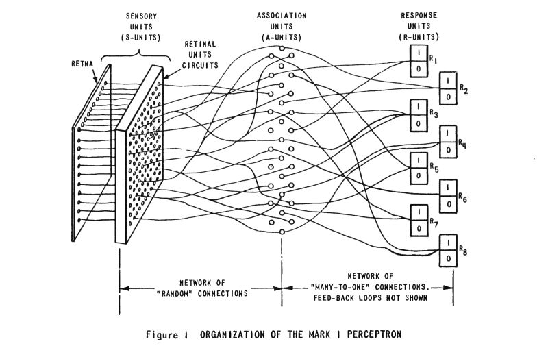]

.footnote[Джерело: Frank Rosenblatt, [Mark I Perceptron operators' manual](https://apps.dtic.mil/sti/pdfs/AD0236965.pdf), 1960.]

???

У листопаді 1958 року Френк Розенблатт винайшов персептрон, або Mark I, у Корнельському університеті. Завершений у 1960 році, це був перший комп’ютер, який міг вивчати нові навички методом проб і помилок, використовуючи тип нейронної мережі, яка симулювала процеси мислення людини.

---

class: middle

.center[
.width-70[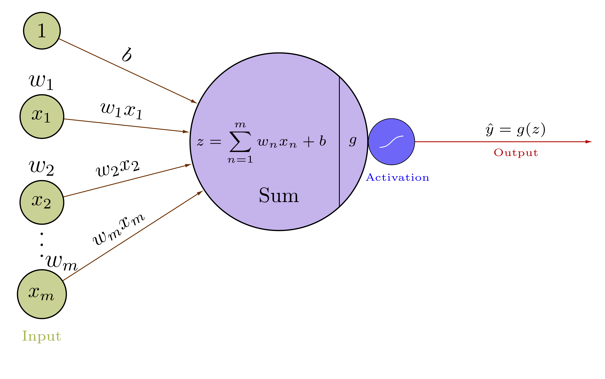]
]

.smaller-xx[
$$
\begin{aligned}
\mathbf{X} = \begin{bmatrix}
x\_1  \\\\
x\_2  \\\\
\vdots \\\\
x\_m
\end{bmatrix} 
&&
\mathbf{W} = \begin{bmatrix}
w\_1  \\\\
w\_2  \\\\
\vdots \\\\
w\_m
\end{bmatrix}
&& 
\mathbf{X}^T = \begin{bmatrix}
x\_1 & x\_2 & \cdots & x\_m
\end{bmatrix} 
\end{aligned}$$

$$\boxed{\begin{aligned}z &= \sum\_{n=1}^{m} w\_n x\_n + b = \mathbf{X}^T \cdot \mathbf{W} + b = \mathbf{W}^T \cdot \mathbf{X} + b \\\\
\hat y &= g(z) \\\\
\mathcal{L}(\hat y, y) &= - \frac{1}{n} \sum\_{i=1}^{n} \big(y^{(i)} \log(\hat y^{(i)}) + (1- y^{(i)}) \log(1 -\hat y^{(i)}) \big)
\end{aligned}}$$

]

---

class: middle

.center[
.width-80[]
]

.smaller-xx[

.center[*Пряме поширення*]

$$\boxed{\begin{aligned}z &= \sum\_{n=1}^{m} w\_n x\_n + b = \mathbf{X}^T \cdot \mathbf{W} + b = \mathbf{W}^T \cdot \mathbf{X} + b \\\\
\hat y &= g(z) \\\\
\mathcal{L}(\hat y, y) &= - \frac{1}{n} \sum\_{i=1}^{n} \big(y^{(i)} \log(\hat y^{(i)}) + (1- y^{(i)}) \log(1 -\hat y^{(i)}) \big)
\end{aligned}}$$

]

---

class: middle

## Приклад

Припустимо $m = 3$

$$
\begin{aligned}
\mathbf{X} = \begin{bmatrix}
x\_1  \\\\
x\_2  \\\\
x\_3
\end{bmatrix} = \begin{bmatrix}
-0.1  \\\\
0.7  \\\\
0.5
\end{bmatrix} 
&&
\mathbf{W} = \begin{bmatrix}
w\_1  \\\\
w\_2  \\\\
w\_3
\end{bmatrix} =
\begin{bmatrix}
1  \\\\
-2  \\\\
2
\end{bmatrix}
&&
b = 0.8
\end{aligned}$$

$$\boxed{\begin{aligned}
z = \sum_{n=1}^{3} w_n x_n + b &= w_1 x_1 + w_2 x_2 + w_3 x_3 + b = \\\\
&= 1 \cdot -0.1 + -2 \cdot 0.7 + 2 \cdot 0.5 + 0.8 = 0.3
\end{aligned}}$$

$$\boxed{\begin{aligned}
z = \mathbf{X}^T \cdot \mathbf{W} + b &= \begin{bmatrix}
x\_1 & x\_2 &  x\_3 
\end{bmatrix} \begin{bmatrix}
w\_1  \\\\
w\_2  \\\\
w\_3
\end{bmatrix} + b = \\\\
&= w_1 x_1 + w_2 x_2 + w_3 x_3 + b = 0.3
\end{aligned}}$$

$$\hat y  = g(z) = g(\mathbf{X}^T \cdot \mathbf{W} + b) = \frac{1}{1 + \exp(-z)} = \frac{1}{1 + \exp(-0.3)} \approx 0.57 $$

---

class: blue-slide, middle, center
count: false

.larger-xx[Одновимірний градієнтний спуск]

---

class: middle

## Одновимірний градієнтний спуск
.smaller-x[

Розглянемо деяку неперервну, диференційовану  функцію $f: \mathbb{R} \rightarrow \mathbb{R}$. Розклавши в ряд Тейлора, ми отримуємо:

$$f(x + \varepsilon) = f(x) + \varepsilon f^{'}(x) + \mathcal{O}(\varepsilon^2)$$

Для простоти давайте виберемо фіксований розмір кроку $\alpha > 0$ та оберемо $\varepsilon = -\alpha f^{'}(x)$. Підставивши це у попередній вираз:

$$f(x -\alpha f^{'}(x)) = f(x) - \alpha f^{'2}(x)  + \mathcal{O}(\alpha^2 f^{'2}(x))$$

Якщо похідна $f^{'}(x) \neq 0$ не зникає, ми робимо прогрес, оскільки $\alpha f^{'2}(x) > 0$. Крім того, ми завжди можемо вибрати $\alpha$ досить малим, щоб вирази вищого порядку занулити. Тому ми приходимо до

$$f(x -\alpha f^{'}(x)) \lessapprox f(x)$$

Це означає, що якщо ми використовуємо:

$$x \leftarrow x -\alpha f^{'}(x)$$

для ітерації по $x$, значення функції $f(x)$  може зменшитись. 
]

???
Gradient descent in one dimension is an excellent example to explain why the gradient descent algorithm may reduce the value of the objective function.

The Taylor series is used to describe what the function looks like in the neighborhood of some poin $x$.

That is, in first-order approximation $f(x + \varepsilon)$  is given by the function value $f(x)$ and the first derivative $f^{'}(x)$ at $x$. It is not unreasonable to assume that for small $\varepsilon$ moving in the direction of the negative gradient will decrease $f$. 

Therefore, in gradient descent we first choose an initial value $x$ and a constant $\alpha > 0$ and then use them to continuously iterate $x$ until the stop condition is reached, for example, when the magnitude of the gradient $|f^{'}(x)|$ is small enough or the number of iterations has reached a certain value.

---

class: middle

.center[
.width-80[]
]

???

For simplicity we choose the objective function $f(x) = x^2$ to illustrate how to implement gradient descent. Although we know that $x = 0$ is the solution to minimize $f(x)$, we still use this simple function to observe how $x$ changes.

---

class: middle

Хід оптимізації за значеннями $x$ 

.center[
.width-80[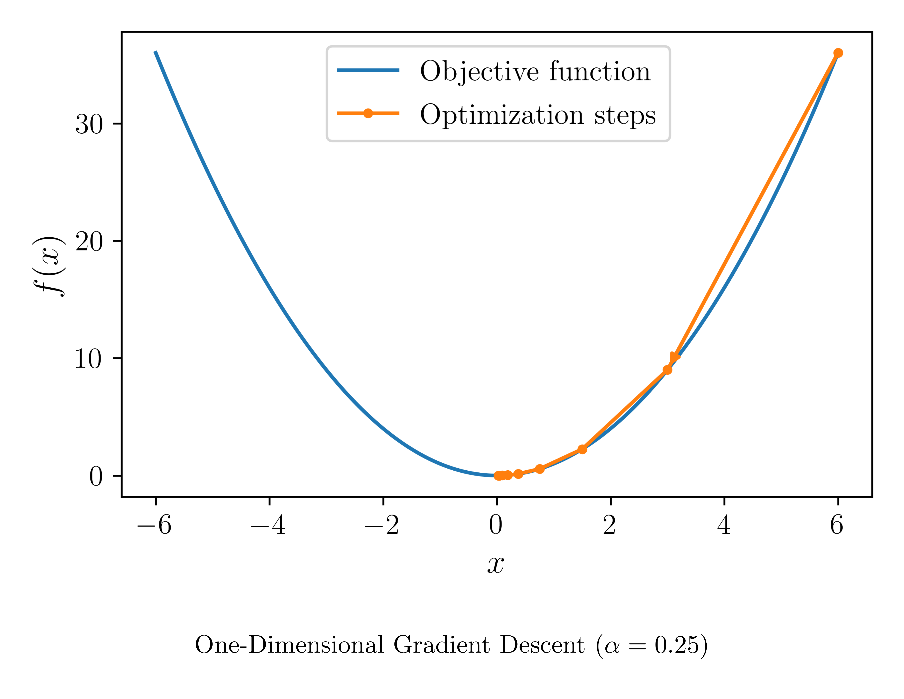]
]

---

class: middle

Хід оптимізації за значеннями $x$ 

.center[
.width-80[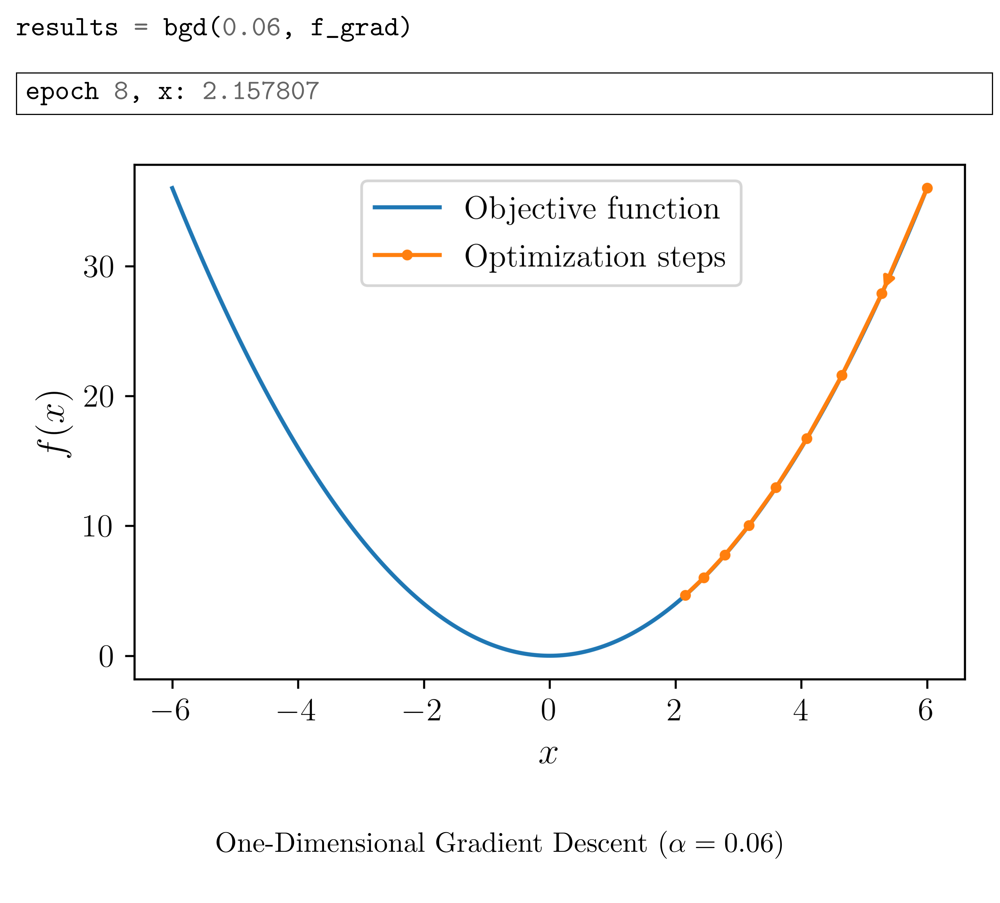]
]

???
If we use a learning rate that is too small, it will cause $x$ to update very slowly, requiring more iterations to get a better solution.

---

lass: middle

Хід оптимізації за значеннями $x$ 

.center[
.width-80[]
]

???
if we use an excessively high learning rate, $|\alpha f^{'}(x)|$ might be too large for the first-order Taylor expansion formula. That is, the term $\mathcal{O}(\alpha^2 f^{'2}(x))$ might become significant. In this case, we cannot guarantee that the iteration of $x$ will be able to lower the value of $f(x)$.

---

class: blue-slide, middle, center
count: false

.larger-xx[Перцептрон: Зворотне поширення]

---

class: middle

У позначеннях Лейбніца **правило ланцюжка** стверджує, що
$$
\begin{aligned}
\frac{\partial \ell}{\partial \theta\_i} &= \sum\_{k \in \text{parents}(\ell)} \frac{\partial \ell}{\partial u\_k} \underbrace{\frac{\partial u\_k}{\partial \theta\_i}}\_{\text{recursive case}}
\end{aligned}$$

---

class: middle

## Зворотне поширення

- Оскільки нейронна мережа є **композицією диференційованих функцій**, загальні похідні втрат можна оцінити зворотно, застосовуючи рекурсивно правило ланцюжка до її обчислювального графу.
- Реалізація цієї процедури називається зворотним *автоматичним диференціюванням* або **зворотним поширенням**.

---

class: middle

.smaller-xx[

.center[*Пряме поширення*]

$$\boxed{\begin{aligned}z &= \sum\_{n=1}^{m} w\_n x\_n + b = \mathbf{X}^T \cdot \mathbf{W} + b = \mathbf{W}^T \cdot \mathbf{X} + b \\\\
\hat y &= g(z) = \sigma(z) = \frac{1}{1 + \exp(-z)} \\\\
\mathcal{L}(\hat y, y) &= - \frac{1}{n} \sum\_{i=1}^{n} \big(y^{(i)} \log(\hat y^{(i)}) + (1- y^{(i)}) \log(1 -\hat y^{(i)}) \big)
\end{aligned}}$$

.grid[
.kol-2-3[

.center[*Зворотне поширення*]

$$\boxed{\begin{aligned}
\frac{\partial \mathcal{L}(\hat y, y)}{\partial \hat y} &= -\frac{y}{\hat y} + \frac{1- y}{1 - \hat y} \\\\[18pt]
\frac{\partial \mathcal{L}(\hat y, y)}{\partial z} &= \frac{\partial \mathcal{L}(\hat y, y)}{\partial \hat y} \frac{\partial \hat y}{\partial z} = \hat y - y \\\\[18pt]
\frac{\partial \mathcal{L}(\hat y, y)}{\partial \mathbf{W}} &= \frac{\partial \mathcal{L}(\hat y, y)}{\partial \hat y} \frac{\partial \hat y}{\partial z} \frac{\partial z}{\partial \mathbf{W}} = \mathbf{X}^T \cdot (\hat y - y) \\\\[18pt]
\frac{\partial \mathcal{L}(\hat y, y)}{\partial b} &=  \frac{\partial \mathcal{L}(\hat y, y)}{\partial \hat y} \frac{\partial \hat y}{\partial z} \frac{\partial z}{\partial b} = \hat y - y
\end{aligned}}$$
]

.kol-1-3[
.center[*Оновлення параметрів*]

$$\boxed{\begin{aligned}
\mathbf{W} &= \mathbf{W} - \alpha \frac{\partial \mathcal{L}(\hat y, y)}{\partial \mathbf{W}} \\\\[18pt]
b &= b - \alpha \frac{\partial \mathcal{L}(\hat y, y)}{\partial b}
\end{aligned}}$$
]]
]

---

class: blue-slide, middle, center
count: false

.larger-xx[Персептрон з багатьма виходами]

---

class: middle

# Multi Output Perceptron

.smaller-x[Оскільки всі входи щільно з’єднані з усіма виходами, ці шари називаються *Dense*]

.center[
.width-70[]
]

$$z\_j = \sum\_{n=1}^{m} w\_{j, n} x\_n  + b\_j$$

---

class: middle

## Example

.center[
.width-50[]
]
.smaller-xx[
$$\begin{aligned}
\mathbf{X}^{m \times 1} = \begin{bmatrix}
x\_1  \\\\
x\_2  \\\\
\vdots \\\\
x\_m
\end{bmatrix} 
&&
\mathbf{W}^{3 \times m} = \begin{bmatrix}
w\_{11} & w\_{12} &  \cdots & w\_{1m} \\\\
w\_{21} & w\_{22} & \cdots & w\_{2m} \\\\
w\_{31} & w\_{32} & \cdots & w\_{3m}
\end{bmatrix}
&& 
\mathbf{b}^{3 \times 1} = \begin{bmatrix}
b\_1 \\\\
b\_2 \\\\
b\_3
\end{bmatrix}
\end{aligned}$$

$$\boxed{\begin{aligned}
\mathbf{z} =  \mathbf{W} \cdot \mathbf{X} + \mathbf{b} 
&= \begin{bmatrix}
w\_{11} & w\_{12} &  \cdots & w\_{1m} \\\\
w\_{21} & w\_{22} & \cdots & w\_{2m} \\\\
w\_{31} & w\_{32} & \cdots & w\_{3m}
\end{bmatrix} \cdot
\begin{bmatrix}
x\_1  \\\\
x\_2  \\\\
\vdots \\\\
x\_m
\end{bmatrix} + 
\begin{bmatrix}
b\_1 \\\\
b\_2 \\\\
b\_3
\end{bmatrix} = \\\\
&= 
\begin{bmatrix}
w\_{11} x\_1 + w\_{12} x\_2 +  \cdots + w\_{1m} x\_m + b\_1 \\\\
w\_{21} x\_1 + w\_{22} x\_2 +  \cdots + w\_{2m} x\_m + b\_2 \\\\
w\_{31} x\_1 + w\_{32} x\_2 +  \cdots + w\_{3m} x\_m + b\_3 
\end{bmatrix} = \begin{bmatrix}
z\_1 \\\\
z\_2 \\\\
z\_3
\end{bmatrix}
\end{aligned}}$$

]

---

class: middle

.center[
.width-100[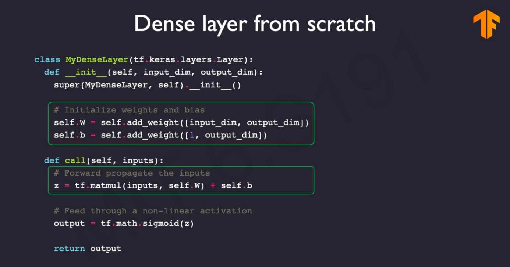]
]

.footnote[Slide source: [MIT 6.S191](http://introtodeeplearning.com/)]

---

class: middle

.smaller-x[Оскільки всі входи щільно з’єднані з усіма виходами, ці шари називаються *Dense*]

.center[
.width-100[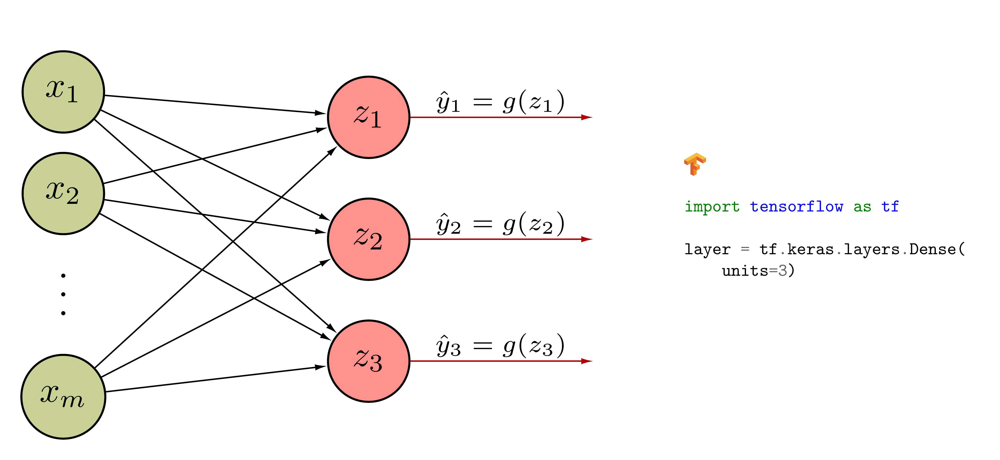]
]

$$z\_j = \sum\_{n=1}^{m} w\_{j, n} x\_n  + b\_j$$

---

class: blue-slide, middle, center
count: false

.larger-xx[Багатошаровий перцептрон]

---

class: middle

# Багатошаровий перцептрон

.center[
.width-100[]
]

---

class: middle

# Мережа з одним прихованим шаром

.center[
.width-100[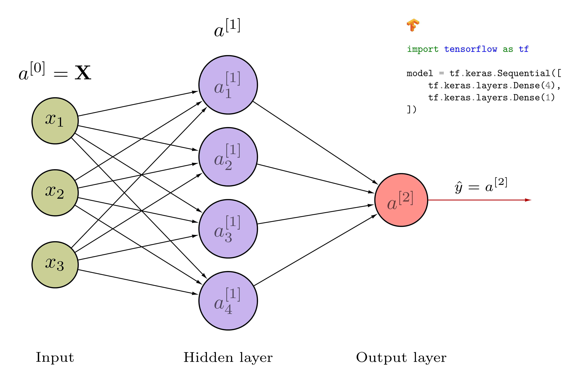]
]

---

class: middle

## Мережа з одним прихованим шаром
.center[
.width-60[]
]

.smaller-xx[
$$\begin{aligned}
\mathbf{X} = \begin{bmatrix}
x\_1  \\\\
x\_2  \\\\
x\_3
\end{bmatrix} 
&&
\mathbf{W}^{[1]} = \begin{bmatrix}
w\_{11} & w\_{12} &  w\_{13} \\\\
w\_{21} & w\_{22} &  w\_{23} \\\\
w\_{31} & w\_{32} &  w\_{33} \\\\
w\_{41} & w\_{42} &  w\_{43}
\end{bmatrix}
&& 
\mathbf{b}^{[1]} = \begin{bmatrix}
b\_1 \\\\
b\_2 \\\\
b\_3 \\\\
b\_4
\end{bmatrix}
&&
\mathbf{W}^{[2]} = \begin{bmatrix}
w\_{1} & w\_{2} &  w\_{3} & w\_{4} 
\end{bmatrix}
&& 
b^{[2]} = b
\end{aligned}$$

$$\boxed{\begin{aligned}
\mathbf{z}^{[1]} &= \mathbf{W}^{[1]} \cdot \mathbf{X} + \mathbf{b}^{[1]} \\\\
\mathbf{a}^{[1]} &= g^{[1]}(\mathbf{z}^{[1]}) \\\\
z^{[2]} &= \mathbf{W}^{[2]} \cdot \mathbf{a}^{[1]} + b^{[2]} \\\\
\hat y &= a^{[2]} = g^{[2]}(z^{[2]})
\end{aligned}}$$
]

---

class: middle

# Глибинна нейронна мережа

.center[
.width-100[]
]

---

class: end-slide, center
count: false

.larger-xx[Кінець]

---

count: false

# Література

- LeCun, Y., Bengio, Y., & Hinton, G. (2015). Deep learning. nature, 521(7553), 436-444.
