class: middle, center, title-slide
# Дослідження і проектування інтелектуальних систем

Лекція 2: Увага та трансформери

  
Кочура Юрій Петрович 
[iuriy.kochura@gmail.com](mailto:iuriy.kochura@gmail.com)  
<a href="https://t.me/y_kochura">@y_kochura</a>  

---

class:  black-slide,
background-image: url(./figures/lec1/robot.png)

 

# Сьогодні

.larger-x[
Увага &mdash; це все, що Вам потрібно!    

 🎙️ Кодер-декодер  
 🎙️ Механізм уваги Бахданау (адитивна увага)  
 🎙️ Шар уваги  
 🎙️ Трансформери  
  
]

???

Завдання: дізнатися про новий фундаментальний будівельний блок сучасних нейронних мереж. Цей блок може замінити як FC, так і згорткові шари.

---

class: blue-slide, middle, center
count: false

.larger-xx[Кодер-декодер]

---

class: middle

У багатьох прикладних задачах обробка сигналів з .bold[послідовною структурою] є необхідною.

- .bold[Класифікація послідовностей]:
    - аналіз емоцій у тексті
    - розпізнавання активності/дій у відео
    - класифікація послідовностей ДНК
- .bold[Синтез послідовностей]:
    - синтез тексту
    - синтез музики
    - синтез руху
- .bold[Переклад послідовностей]:
    - розпізнавання мови
    - переклад тексту
    - прогнозування часових рядів

.footnote[Джерело: Francois Fleuret, [14x050/EE559 Deep Learning](https://fleuret.org/dlc/), EPFL.]

---

class: middle

Нехай $\mathcal{X}$ &mdash; це множина токенів. Тоді $S(\mathcal{X})$ &mdash; це множина усіх послідовностей довільної довжини,
$$S(\mathcal{X}) = \\{(x\_1, x\_2, ..., x\_n) \mid n \ge 1, x\_i \in \mathcal{X}\\} =  \bigcup\_{n=1}^\infty \mathcal{X}^n,$$ тоді ми формально визначаємо:

.grid.center[
.kol-1-2.bold[Класифікація послідовностей]
.kol-1-2[$f: S(\mathcal{X}) \to \bigtriangleup^C$]
]
.grid.center[
.kol-1-2.bold[Синтез послідовностей]
.kol-1-2[$f: \mathbb{R}^d \to S(\mathcal{X})$]
]
.grid.center[
.kol-1-2.bold[Послідовність-послідовність]
.kol-1-2[$f: S(\mathcal{X}) \to S(\mathcal{Y})$]
]

.alert[Токен &mdash; це елемент послідовності, який модель обробляє як окрему одиницю.]

.footnote[Джерело: Francois Fleuret, [EE559 Deep Learning](https://fleuret.org/ee559/), EPFL.]

---

class: middle

Коли вхідними даними є послідовність $\mathbf{x} \in S(\mathbb{R}^p)$ змінної довжини, зазвичай використовують архітектуру .bold[«кодер–декодер»], яка спочатку стискає вхідні дані в єдиний вектор $v$, а потім використовує його для генерації вихідної послідовності.

 

.center.width-85[]

*Приклад*
- .bold[Вхід:] I am learning AI.
- .bold[Вихід:] Я вивчаю ШІ.

.footnote[Джерело: [Dive Into Deep Learning](https://d2l.ai), 2023.]

???
У задачах типу послідовність → послідовність, наприклад, у машинному перекладі, вхідні та вихідні дані можуть мати різну довжину і не завжди «погоджені» між собою.

Приклад:
- I am learning AI.
- Я вивчаю ШІ.

Щоб працювати з такими даними, зазвичай використовують архітектуру «кодер–декодер»:

- Енкодер приймає вхідну послідовність будь-якої довжини і перетворює її на компактне внутрішнє представлення.
- Декодер працює як умовна мовна модель: він отримує закодовану інформацію від енкодера та вже згенеровані токени вихідної послідовності, щоб передбачити наступний токен.

Таким чином, модель може поступово генерувати вихідну послідовність, навіть якщо її довжина буде відрізняється від довжини вхідної.

---

class: middle

.center.width-100[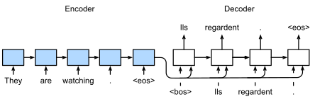]

Рекурентні моделі кодер-декодер стискають вхідну послідовність $\mathbf{x}\_{1:T}$ в єдиний вектор $v$, а потім генерують вихідну послідовність $\mathbf{y}\_{1:T'}$ з авторегресійної генеративної моделі:
$$\begin{aligned}
\mathbf{h}\_t &= \phi(\mathbf{x}\_t, \mathbf{h}\_{t-1})\\\\
v &= \mathbf{h}\_{T} \\\\
\mathbf{y}\_{i} &\sim p(\cdot | \mathbf{y}\_{1:i-1}, v).
\end{aligned}$$

.footnote[Джерело: [Dive Into Deep Learning](https://d2l.ai), 2023.]

???

Перекладіть на англійську. 

"Кіт не перейшов вулицю, бо був занадто втомлений."

->

"The сat didn't cross the street because it was too tired."

---

class: middle

.center.width-80[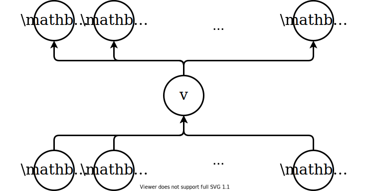]

Ця архітектура передбачає, що єдиний вектор $v$ містить достатньо інформації для генерації всієї вихідної послідовності. Це часто є **складним завданням** для довгих послідовностей.

.footnote[Джерело: ULiège - SEGI.]

???

Не існує прямих «каналів» для передачі локальної інформації від вхідної послідовності до місця, де вона буде корисною в результуючій послідовності.

Проблема схожа на ту, що була з FCN без пропускних з'єднань: інформація застрягла в єдиному векторі $v$.

---

class: blue-slide, middle, center
count: false

.larger-xx[Механізм уваги Бахданау   (адитивна увага)]

---

.center.width-75[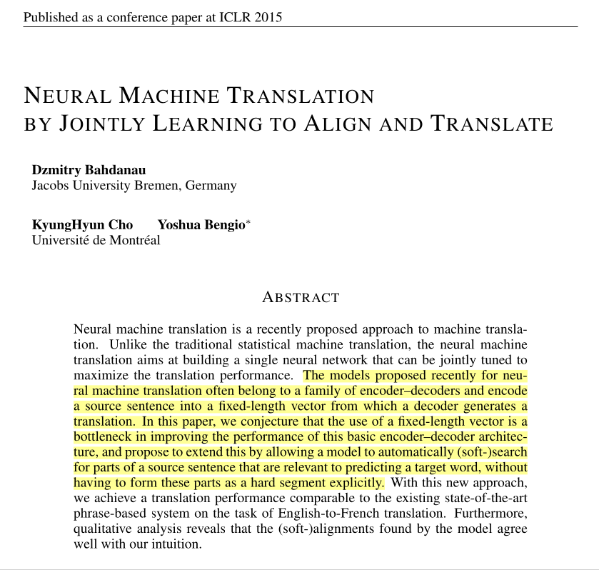]

.footnote[Джерело: [Neural machine translation by jointly learning to align and translate](https://arxiv.org/pdf/1409.0473).]

???
На сьогодні більшість моделей для обробки структурованих даних використовують рекурентні або згорткові мережі у конфігурації кодер-декодер. Найефективніші моделі з’єднують декодер з енкодером через механізм уваги.

---

class: black-slide
background-image: url(figures/lec2/vision.png)
background-size: cover

???
Увага (attention) — це механізм у нейронних мережах, який дозволяє моделі вибірково фокусуватися на найважливіших частинах вхідних даних під час виконання певного завдання.

Ключова ідея
- Замість того, щоб обробляти всю інформацію однаково, модель «звертає увагу» на релевантні елементи, що підвищує точність і ефективність.
- Може розглядатися як динамічний фільтр, який визначає, які частини вхідних даних важливі на даному кроці обчислень.

---

class: middle

.center.width-75[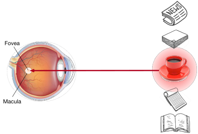]

.footnote[Джерело: [Dive Into Deep Learning](https://d2l.ai), 2023.]

---

class: middle

.center.width-75[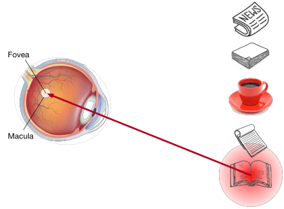]

Використовуючи вольовий сигнал (бажання прочитати книгу), який залежить від завдання, увага спрямовується на книгу під вольовим контролем.

.footnote[Джерело: [Dive Into Deep Learning](https://d2l.ai), 2023.]

---

class: middle

.center.width-100[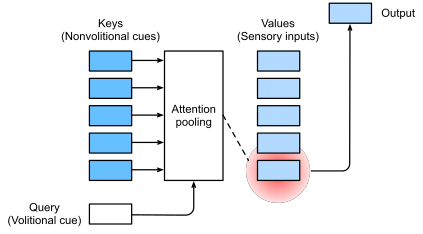]

.footnote[Джерело: [Dive Into Deep Learning](https://d2l.ai), 2023.]

???

1. Query (запит) — це вектор, який представляє те, що ми шукаємо. Наприклад, у перекладі речення — це поточне слово, яке ми намагаємося перекласти.
2. Key (ключ) — це вектор, який описує ознаки (властивості) кожного елемента у вхідній послідовності. Він відповідає на питання: «що містить цей елемент?».
3. Value (значення) — це вектор з інформацією, яку ми реально використовуємо, якщо елемент виявився важливим.

## Аналогія

Уяви, що Ви читаєте книгу і шукаєте відповідь на конкретне питання (Query).

- Твоє питання — це Query.
- Заголовки розділів у книжці — це Keys (вказують, де може бути відповідь).
- Текст у цих розділах — це Values (сама інформація).

Ти порівнюєш своє питання із заголовками (Query з Key), знаходиш найбільш відповідний розділ і береш звідти інформацію (Value).

Врешті-решт, сенсорні вхідні дані обмежуються невеликою частиною інформації, яка доступна в навколишньому середовищі. У цьому полягає суть уваги.

---

class: middle

Механізм уваги може переносити інформацію з окремих частин вхідного сигналу до частин виходу, .bold[визначених динамічно]. Тобто модель на кожному кроці сама «вирішує», на які токени вхідної послідовності звернути увагу для формування поточного вихідного токена.

За припущенням, що кожен вихідний токен утворюється з одного або кількох вхідних токенів, декодер має зосереджуватися лише на тих токенах, які є релевантними для генерування наступного вихідного токена.

.center[
.width-100[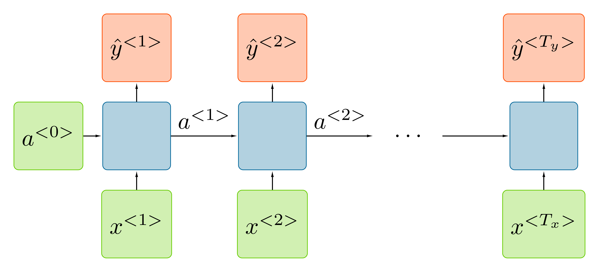]
]

---

class: middle, 

# Пряме поширення
.center[
.width-80[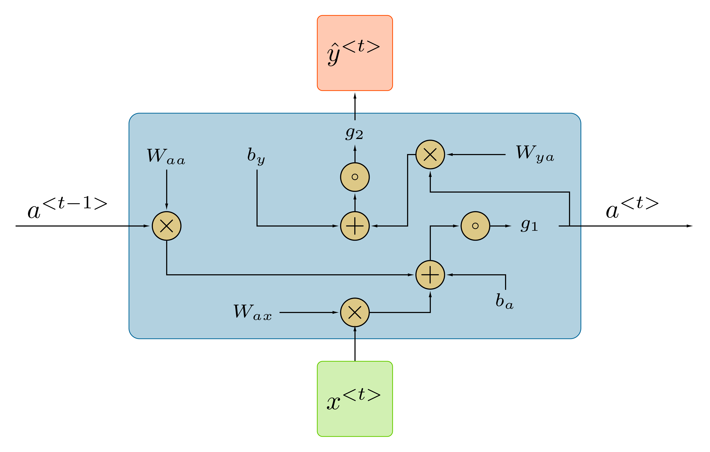]
]
.smaller-x[Для кожного часового кроку  $t$ активація $a^{\langle t \rangle}$ і вихід $y^{\langle t \rangle}$ виражаються таким чином: 

$$\boxed{\begin{aligned}a^{\langle t \rangle} &= g\_1(W\_{aa} a^{\langle t-1 \rangle} + W\_{ax}x^{\langle t \rangle} + b\_a) \\\\
\hat y^{\langle t \rangle} &= g\_2(W\_{ya} a^{\langle t \rangle} +  b\_y)
 \end{aligned}}$$

]

.footnote[Джерело слайду: [Sequence Models](https://www.coursera.org/learn/nlp-sequence-models) [[video](https://www.coursera.org/learn/nlp-sequence-models/lecture/ftkzt/recurrent-neural-network-model)], Andrew Ng et al.]

???
Залежно від того, який очікується тип передбачення RNN $\hat y$, якщо це задача бінарної класифікації, ви б використали сигмоїду для активації виходу, або це може бути softmax, якщо ви вирішуєте багатокласову задачу класифікації (k класів). 

У модулі RNN для обчислення ативації $a^{\langle t \rangle}$ зазвичай використовують в якості $g\_1$ tanh, ця ативаційна функція  дозволяє запобігти проблемі зникаючого градієнта, про яку ми поговоримо пізніше.

Для завдання name entity recognition, на виході моделі очікується отримати $\hat y$ 0 або 1, тому другу ативацію $g\_2$ можа обрати сигмоїду. 

Ці рівняння визначають пряме поширення в RNN. 

---
class: middle

.center[
.width-100[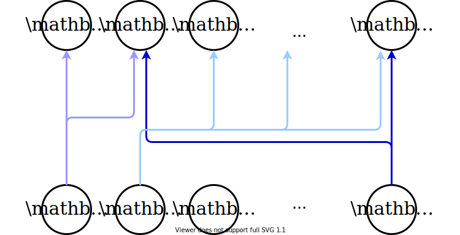]
]

.footnote[Джерело: ULiège - SEGI.]

---

class: middle

## Машинний переклад на основі уваги

Та сама архітектура RNN в якій  *кодер* та *декодер* з'єднані через механізм уваги.

.center.width-90[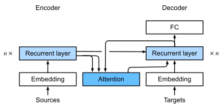]

.footnote[Джерело: [Dive Into Deep Learning](https://d2l.ai), 2023.]

???

Та сама архітектура кодера-декодера на основі RNN, але з механізмом уваги між ними.

---

class: middle

Відповідно до Bahdanau et al. (2014), кодер визначається як двонаправлена рекурентна нейронна мережа (RNN), яка обчислює вектор анотації для кожного вхідного токена,
$$\mathbf{h}\_j = (\overrightarrow{\mathbf{h}}\_j, \overleftarrow{\mathbf{h}}\_j)$$
для $j = 1, \ldots, T$, де $\overrightarrow{\mathbf{h}}\_j$ та $\overleftarrow{\mathbf{h}}\_j$ відповідно позначають прямі та зворотні приховані рекурентні стани (активації) двонаправленої RNN.

На основі цього декодер обчислює новий процес $\mathbf{s}\_i$, $i=1, \ldots, T'$, який розглядає зважені середні значення $\mathbf{h}\_j$, де .bold[ваги є функціями сигналу].

$\mathbf{s}\_i$ &mdash; це прихований стан декодера.

.footnote[Джерело: Francois Fleuret, [Deep Learning](https://fleuret.org/dlc/), UNIGE/EPFL.]

---

.center.width-50[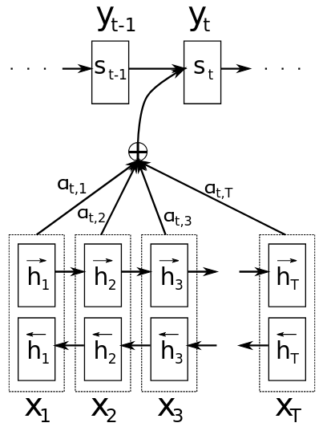]

.footnote[Джерело: [Neural machine translation by jointly learning to align and translate](https://arxiv.org/pdf/1409.0473).]

---

class: middle

Для заданих $\mathbf{y}\_1, \ldots, \mathbf{y}\_{i-1}$ та $\mathbf{s}\_1, \ldots, \mathbf{s}\_{i-1}$спочатку обчисліть вектор уваги:
$$\mathbf{\alpha}\_{i,j} = \text{softmax}\_j(a(\mathbf{s}\_{i-1}, \mathbf{h}\_j)) = \frac{\exp{(e\_{ij})}}{\sum\_{k=1}^T \exp{(e\_{ik})}}$$
для $j=1, \ldots, T$, де 
- $e\_{ij} = a(\mathbf{s}\_{i-1}, \mathbf{h}\_j)$;
- $a$ &mdash; .bold[функція оцінки уваги], яка тут задана як MLP з одним прихованим шаром $\text{tanh}$;

- $\mathbf{y}$ &mdash; це правильні вихідні токени (мітки) під час навчання;
- $\mathbf{s}$ &mdash; це приховані стани декодера, які оновлюються крок за кроком.

Потім обчисліть вектор контексту з урахуванням зважених значень $\mathbf{h}\_j$:
$$\mathbf{c}\_i = \sum\_{j=1}^T \alpha\_{i, j} \mathbf{h}\_j.$$

.footnote[Джерело: Francois Fleuret, [Deep Learning](https://fleuret.org/dlc/), UNIGE/EPFL.]

???

Зверніть увагу, що ваги уваги залежать від змісту, а не від позиції в реченні. Це означає, що вони діють як форма *адресації на основі змісту*.

---

class: middle

Тепер модель може зробити прогноз $\mathbf{y}\_i$:
$$
\begin{aligned}
\mathbf{s}\_i &= f(\mathbf{s}\_{i-1}, y\_{i-1}, c\_i)  \\\\
\mathbf{y}\_i &\sim g(\mathbf{y}\_{i-1}, \mathbf{s}\_i, \mathbf{c}\_i),
\end{aligned}
$$
де $f$ &mdash; [Gated Recurrent Unit (GRU)](https://arxiv.org/pdf/1409.1259).

Це **увага до контексту**, де $\mathbf{s}\_{i-1}$ визначає, що шукати в $\mathbf{h}\_1, \ldots, \mathbf{h}\_{T}$ для обчислення $\mathbf{s}\_i$ та зразка $\mathbf{y}\_i$.

---

class: middle

.center.width-100[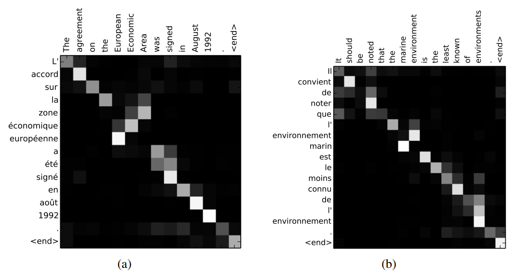]

.footnote[Джерело: [Neural machine translation by jointly learning to align and translate](https://arxiv.org/pdf/1409.0473).]

???

- Source = English
- Target = French

---

class: blue-slide, middle, center
count: false

.larger-xx[Шар уваги]

---

class: middle

Механізми уваги можна загалом визначити наступним чином.

Для заданого контексту або вектора запиту (Query) $\mathbf{q} \in \mathbb{R}^{q}$, тензора ключів (Key) $\mathbf{K} \in \mathbb{R}^{m \times k}$ та тензора значень $\mathbf{V} \in \mathbb{R}^{m \times v}$ шар уваги обчислює вектор виходу $\mathbf{y} \in \mathbb{R}^{v}$
за формулою: $$\mathbf{y} = \sum\_{i=1}^m \text{softmax}\_i(a(\mathbf{q}, \mathbf{K}\_i; \theta)) \mathbf{V}\_i,$$
де $a : \mathbb{R}^q \times \mathbb{R}^k \to \mathbb{R}$ — скалярна функція оцінки уваги, 
$\theta$ &mdash; навчальні параметри, які перетворюють Query і Key у числову оцінку уваги.

---

class: middle

.center.width-100[]

.footnote[Джерело: [Dive Into Deep Learning](https://d2l.ai), 2023.]

---

class: middle

## Адитивна увага

У випадку, коли запити та ключі є векторами різної довжини, ми можемо використовувати адитивну увагу як функцію оцінки.

Для $\mathbf{q} \in \mathbb{R}^{q}$ та $\mathbf{k} \in \mathbb{R}^{k}$ функція оцінки **адитивної уваги** має вигляд:
$$a(\mathbf{q}, \mathbf{k}) = \mathbf{w}_v^T \tanh(\mathbf{W}\_q^T \mathbf{q} + \mathbf{W}\_k^T \mathbf{k})$$
де $\mathbf{w}_v \in \mathbb{R}^h$, $\mathbf{W}_q \in \mathbb{R}^{q \times h}$ та $\mathbf{W}_k \in \mathbb{R}^{k \times h}$ &mdash; навчальні параметрами.

---

class: middle

## Масштабований скалярний добуток уваги

Коли запити та ключі є векторами однакової довжини $d$, ми можемо використовувати масштабований скалярний добуток уваги як функцію оцінки.

Для $\mathbf{q} \in \mathbb{R}^{d}$ та $\mathbf{k} \in \mathbb{R}^{d}$ функція оцінки **масштабованого скалярного добутку уваги** має вигляд:
$$a(\mathbf{q}, \mathbf{k}) = \frac{\mathbf{q}^T \mathbf{k}}{\sqrt{d}}$$

---

class: middle

Для $n$ запитів $\mathbf{Q} \in \mathbb{R}^{n \times d}$, ключів $\mathbf{K} \in \mathbb{R}^{m \times d}$ і значень $\mathbf{V} \in \mathbb{R}^{m \times v}$ шар **масштабованого скалярного добутку уваги** обчислює вихідний тензор:
$$\mathbf{Y} = \underbrace{\text{softmax}\left(\frac{\mathbf{QK}^T}{\sqrt{d}}\right)}\_{\text{матриця уваги}\, \mathbf{A}}\mathbf{V} \in \mathbb{R}^{n \times v}$$

---

class: middle

.center.width-80[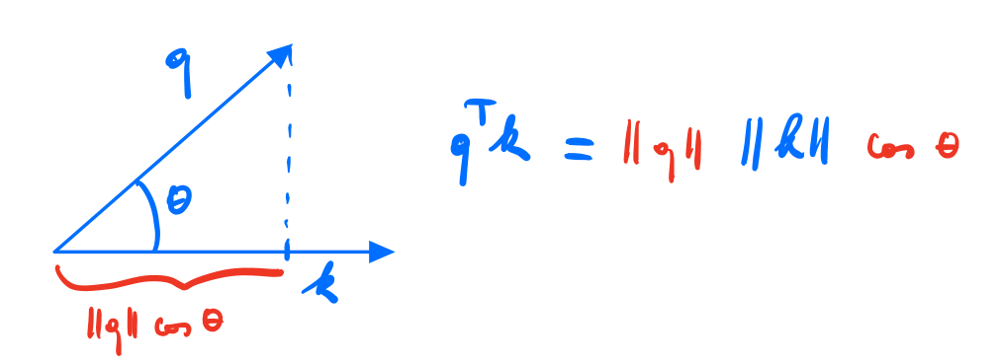]

Cкалярний добуток двох векторів &mdash; це число, яке рівне добутку довжин цих векторів на косинус кута між ними (коефіцієнт подібності двох не нульових векторів).

Отже, матриця $\mathbf{QK}^T$ є **матрицею подібності** між запитами та ключами.

.footnote[Джерело: ULiège - SEGI.]

---

class: middle

.center.width-100[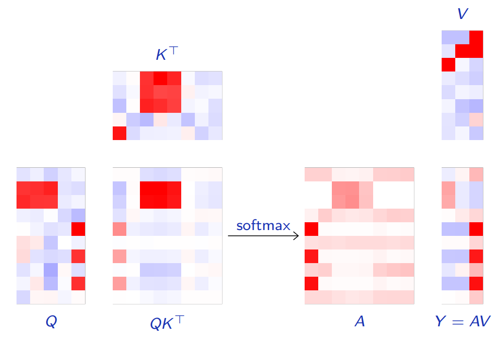]

.footnote[Джерело: Francois Fleuret, [Deep Learning](https://fleuret.org/dlc/), UNIGE/EPFL.]

---

class: middle

У сучасних стандартних моделях обробки послідовностей запити, ключі та значення є лінійними функціями вхідних даних.

Нехай матриці навчальних параметрів мають вигляд $\mathbf{W}\_q \in \mathbb{R}^{d \times x}$, $\mathbf{W}\_k \in \mathbb{R}^{d \times x'}$, і $\mathbf{W}\_v \in \mathbb{R}^{v \times x'}$, а також дві послідовності вхідних ознак $\mathbf{X} \in \mathbb{R}^{n \times x}$ і $\mathbf{X}' \in \mathbb{R}^{m \times x'}$, з яких формуються запити (Queries), ключі (Keys) та значення (Values), тоді маємо:
$$\begin{aligned} 
\mathbf{Q} &= \mathbf{X} \mathbf{W}\_q^T \in \mathbb{R}^{n \times d} \\\\
\mathbf{K} &= \mathbf{X'} \mathbf{W}\_k^T \in \mathbb{R}^{m \times d} \\\\
\mathbf{V} &= \mathbf{X'} \mathbf{W}\_v^T \in \mathbb{R}^{m \times v}
\end{aligned}$$

- $\mathbf{X}$ — приховані стани декодера (формують Queries).
- $\mathbf{X'}$ — приховані стани кодера (формують Keys і Values).

---

class: middle

## Self-attention ([самоувага](https://developers.google.com/machine-learning/crash-course/llm/transformers?hl=uk#what_is_self-attention))

Коли запити, ключі та значення отримуються з одних і тих самих вхідних даних, механізм уваги називається **самоувагою**.

Для масштабованого скалярного добутку уваги шар самоуваги отримується, коли $\mathbf{X} = \mathbf{X}'$.

Тому самоувага може використовуватися як звичайний шар прямого поширення, аналогічно до повнозв’язних або згорткових шарів.

 
.center.width-60[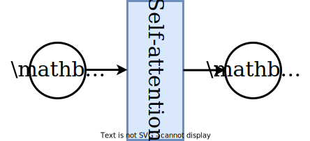]

.footnote[Джерело: ULiège - SEGI.]

---

class: middle 

## CNNs vs. RNNs vs. self-attention

.center.width-80[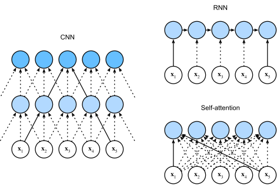]

.footnote[Джерело: [Dive Into Deep Learning](https://d2l.ai), 2023.]

???

Порівняємо різні типи будівельних блоків.

CNNs:
- Сильні сторони: паралельна обробка, ефективна для коротших послідовностей
- Обмеження: обмежене контекстне вікно, визначене розміром ядра
- Ключовий момент: довжина шляху O(log_k(n)) (з об'єднанням) означає, що інформація проходить через менше перетворень, ніж у RNN

RNNs:
- Сильні сторони: природна обробка послідовностей, ефективне використання пам'яті
- Обмеження: послідовна обробка створює вузькі місця
- Ключовий момент: довжина шляху O(n) означає втрату інформації в довгих послідовностях

Self-Attention:
- Сильні сторони: пряме з'єднання між будь-якими позиціями, довжина шляху O(1)
- Обмеження: складність O(n²) стає неприйнятною для дуже довгих послідовностей
- Ключовий момент: ця квадратична складність є ціною, яку ми платимо за великі можливості представлення

---

class: middle

.center.width-100[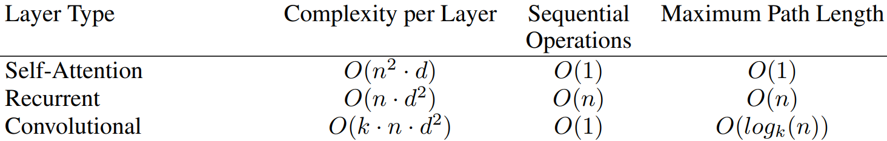]

де $n$ — довжина послідовності, $d$ — розмірність вбудовування, а $k$ — розмір ядра згортки.

???

Як зазначено в таблиці 1, шар самоуваги з'єднує всі позиції з константною кількістю послідовно виконаних операцій, тоді як рекурентний шар вимагає O(n) послідовних операцій. З точки зору обчислювальної складності, шари самоуваги є швидшими за рекурентні шари, коли довжина послідовності $n$ є меншою за розмірність представлення $d$, що найчастіше має місце у випадку представлення речень, яке використовується в найсучасніших моделях машинного перекладу, таких як представлення word-piece[38] та byte-pair [31]. 

Один згортковий шар з ядром $k < n$ не з'єднує всі пари вхідних і вихідних позицій. Для цього потрібно стек з $O(n/k)$ згорткових шарів у випадку сусідніх ядер, або $O(logk(n))$ у випадку розширених згорток [18], що збільшує довжину найдовших шляхів між будь-якими двома позиціями в мережі. Згорткові шари, як правило, дорожчі за рекурентні шари в $k$ разів. 

---

class: middle

## Приклад

Щоб проілюструвати поведінку механізму уваги, розглянемо просту задачу з 1d послідовностями, що складаються з двох трикутників і двох прямокутників. Цільова послідовність (Target) усереднює висоти в кожній парі фігур.

.center.width-100[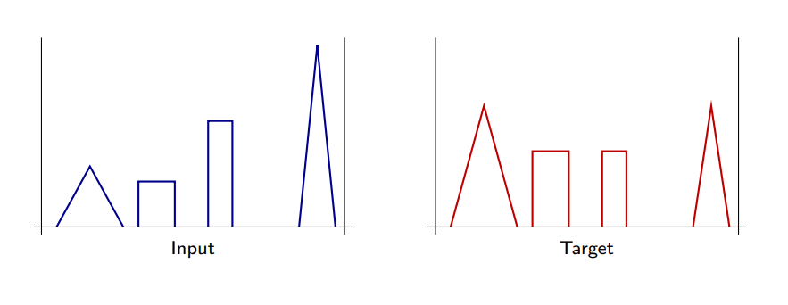]

.footnote[Джерело: Francois Fleuret, [Deep Learning](https://fleuret.org/dlc/), UNIGE/EPFL.]

---

class: middle

.center.width-80[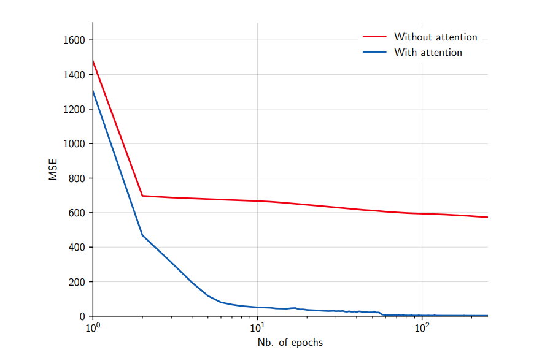]

.footnote[Джерело: Francois Fleuret, [Deep Learning](https://fleuret.org/dlc/), UNIGE/EPFL.]

---

class: middle

Ми можемо модифікувати задачу, щоб розглянути мету (Target), де парами для усереднення є дві крайні фігури праворуч і ліворуч.

.center.width-100[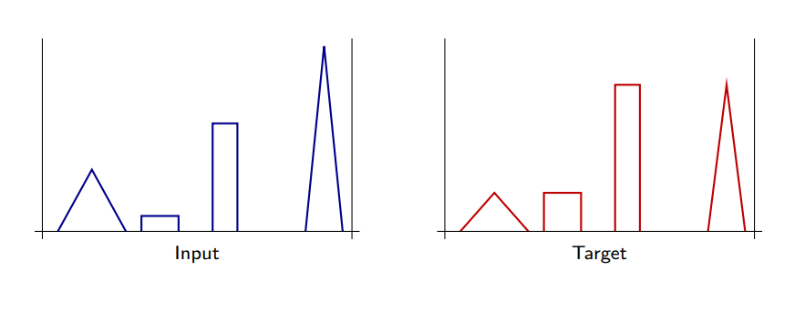]

.footnote[Джерело: Francois Fleuret, [Deep Learning](https://fleuret.org/dlc/), UNIGE/EPFL.]

---

class: middle

Очікується, що продуктивність буде низькою, враховуючи нездатність шару самоуваги враховувати абсолютні або відносні позиції. Дійсно, самоувага є інваріантною до перестановки:
$$\begin{aligned}
\mathbf{y} &= \sum\_{i=1}^m \text{softmax}\_i\left(\frac{\mathbf{q}^T{\mathbf{K}^T\_{i}}}{\sqrt{d}}\right) \mathbf{V}\_{i}\\\\
&= \sum\_{i=1}^m \text{softmax}\_{i}\left(\frac{\mathbf{q}^T{\mathbf{K}^T\_{\sigma(i)}}}{\sqrt{d}}\right) \mathbf{V}\_{\sigma(i)}
\end{aligned}$$
для будь-якої перестановки $\sigma$ пар ключ-значення.

(Самоувага також еквівалентна перестановці $\sigma$ запитів.)

---

class: middle

.center.width-80[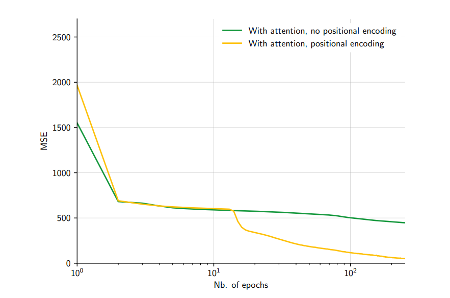]

Однак цю проблему можна вирішити, надавши позиційне кодування явно шару уваги.

.footnote[Джерело: Francois Fleuret, [Deep Learning](https://fleuret.org/dlc/), UNIGE/EPFL.]

---

class: blue-slide, middle, center
count: false

.larger-xx[Трансформери]

---

class: middle

Vaswani та ін. (2017) запропонували піти ще далі: замість використання механізму уваги як доповнення до стандартних згорткових і рекурентних шарів, вони розробили будівельний блок .bold[трансформера], що складається виключно з шарів уваги.

Трансформер був розроблений для завдання перекладу послідовність-послідовність, але в даний час цей блок є ключовим елементом найсучасніших підходів до більшості завдань, що стосуються обробки наборів або послідовностей.

.footnote[Джерело: Francois Fleuret, [Deep Learning](https://fleuret.org/dlc/), UNIGE/EPFL.]

---

class: middle

.center.width-65[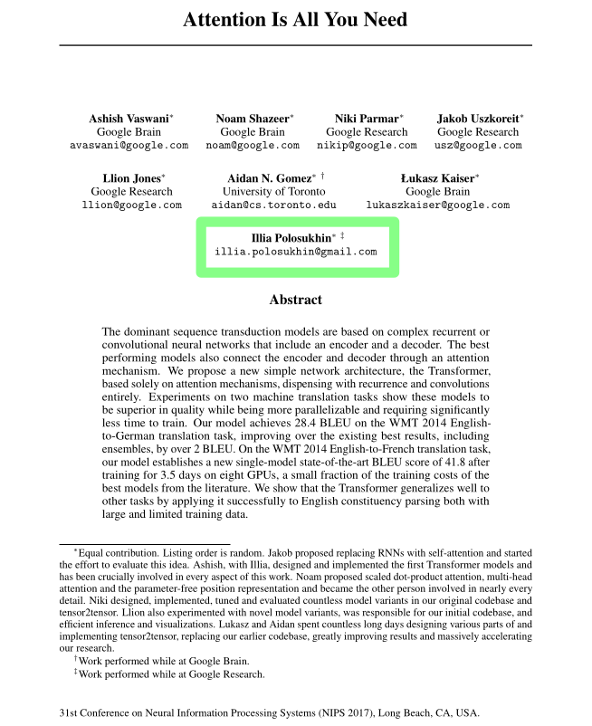]

.footnote[Джерело: [Attention Is All You Need](https://arxiv.org/pdf/1706.03762v7).]

---

.grid[
.kol-1-1[ 
.circle.center.width-40[]
.larger-xx.bold.center[.width-10[] Ілля Полосухін] 

.bold.center[Національний технічний університет   «Харківський політехнічний інститут»]]
]

.success[Співавтор наукової роботи “Attention Is All You Need”, яка започаткувала епоху трансформерів у штучному інтелекті.]

.footnote[LinkedIn: [Illia Polosukhin](https://www.linkedin.com/in/illia-polosukhin-77b6538/), [[Українець Ілля Полосухін був серед 8 дослідників Google, які закладали основи сучасного ШІ. Як це було]](https://dev.ua/news/ukrainets-zakladav-osnovy-shi-v-google-1710942264).]
---

class: middle

## Scaled dot-product attention

The first building block of the transformer architecture is a scaled dot-production attention module
$$\text{attention}(\mathbf{Q}, \mathbf{K}, \mathbf{V}) = \text{softmax}\left(\frac{\mathbf{Q}\mathbf{K}^T}{\sqrt{d\_k}}\right) \mathbf{V}$$
where the $1/\sqrt{d\_k}$ scaling is used to keep the (softmax's) temperature constant across different choices of the query/key dimension $d\_k$.

---

class: middle

.center.width-55[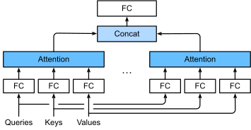]

## Multi-head attention

The transformer projects the queries, keys and values $h=8$ times with distinct linear projections to $d\_k=64$, $d\_k=64$ and $d\_v=64$ dimensions respectively.
$$
\begin{aligned}
\text{multihead}(\mathbf{Q}, \mathbf{K}, \mathbf{V}) &= \text{concat}\left(\mathbf{H}\_1, \ldots, \mathbf{H}\_h\right) \mathbf{W}^O\\\\
\mathbf{H}\_i &= \text{attention}(\mathbf{Q}\mathbf{W}\_i^Q, \mathbf{K}\mathbf{W}\_i^K, \mathbf{V}\mathbf{W}\_i^V)
\end{aligned}
$$
with
$$\mathbf{W}\_i^Q \in \mathbb{R}^{d\_\text{model} \times d\_k}, \mathbf{W}\_i^K \in \mathbb{R}^{d\_\text{model} \times d\_k}, \mathbf{W}\_i^V \in \mathbb{R}^{d\_\text{model} \times d\_v}, \mathbf{W}\_i^O \in \mathbb{R}^{hd\_v \times d\_\text{model}}$$

.footnote[Джерело: [Dive Into Deep Learning](https://d2l.ai), 2023.]

---

class: middle

## Encoder-decoder architecture

The transformer model is composed of:
- An encoder that combines $N=6$ modules, each composed of a multi-head attention sub-module, and a (per-component) one-hidden-layer MLP, with residual pass-through and layer normalization. All sub-modules and embedding layers produce outputs of dimension $d\_\text{model}=512$.
- A decoder that combines $N=6$ modules similar to the encoder, but using masked self-attention to prevent positions from attending to subsequent positions. In addition, the decoder inserts a third sub-module which performs multi-head attention over the output of the encoder stack.

---

class: middle

.center.width-60[]

.footnote[Джерело: [Dive Into Deep Learning](https://d2l.ai), 2023.]

---

class: middle

.center.width-90[]

The encoders start by processing the input sequence. The output of the top encoder is then transformed into a set of attention vectors $\mathbf{K}$ and $\mathbf{V}$ passed to the decoders.

.footnote[Джерело: Jay Alammar, [The Illustrated Transformer](https://jalammar.github.io/illustrated-transformer/).]

---

class: middle

.center.width-90[]

Each step in the decoding phase produces an output token, until a special symbol is reached indicating the completion of the transformer decoder's output.

The output of each step is fed to the bottom decoder in the next time step, and the decoders bubble up their decoding results just like the encoders did. 

.footnote[Джерело: Jay Alammar, [The Illustrated Transformer](https://jalammar.github.io/illustrated-transformer/).]

---

class: middle

In the decoder:
- The first masked self-attention sub-module is only allowed to attend to earlier positions in the output sequence. This is done by masking future positions.
- The second multi-head attention sub-module works just like multi-head self-attention, except it creates its query matrix from the layer below it, and takes the keys and values matrices from the output of the encoder stack.

.footnote[Джерело: Jay Alammar, [The Illustrated Transformer](https://jalammar.github.io/illustrated-transformer/).]

---

class: middle

## Positional encoding

Positional information is provided through an **additive** positional encoding of the same dimension $d\_\text{model}$ as the internal representation and is of the form
$$
\begin{aligned}
\text{PE}\_{t,2i} &= \sin\left(\frac{t}{10000^{\frac{2i}{d\_\text{model}}}}\right) \\\\
\text{PE}\_{t,2i+1} &= \cos\left(\frac{t}{10000^{\frac{2i}{d\_\text{model}}}}\right).
\end{aligned}
$$

After adding the positional encoding, words will be closer to each other based on the similarity of their meaning and their relative position in the sentence, in the $d\_\text{model}$-dimensional space.

Alternatively, the model can also learn the positional encoding.

???

All words of input sequence are fed to the network with no special order or position; in contrast, in an RNN, the 𝑛-th word is fed at step 𝑛, and in a CNN, it is fed to specific input indices. 

---

class: middle

.width-100[]

.center[128-dimensional positonal encoding for a sentence with the maximum length of 50. Each row represents the embedding vector.]

---

class: middle

## Machine translation

The transformer architecture was first designed for machine translation and tested on English-to-German and English-to-French translation tasks.

.center[

.width-100[]

Self-attention layers learned that "it" could refer  to different entities, in different contexts.
  
]

.footnote[Джерело: [Transformer: A Novel Neural Network Architecture for Language Understanding](https://ai.googleblog.com/2017/08/transformer-novel-neural-network.html), 2017.]

---

class: middle

.center[

.width-100[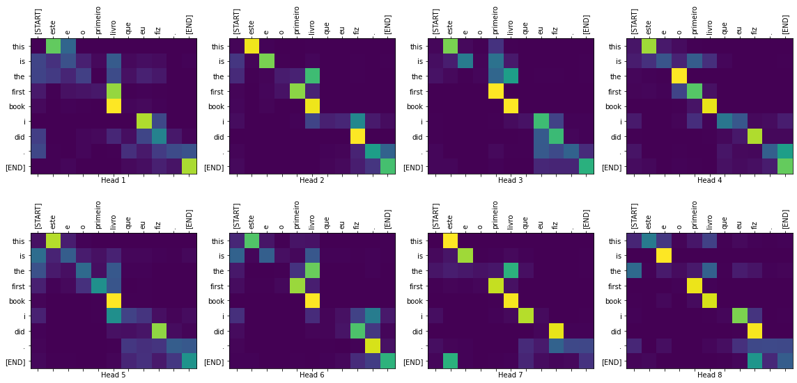]

Attention maps extracted from the multi-head attention modules  show how input tokens relate to output tokens.
  
]

.footnote[Джерело: [Transformer model for language understanding](https://www.tensorflow.org/tutorials/text/transformer).]

---

class: middle

## Decoder-only transformers

The decoder-only transformer has become the de facto architecture for large language models $p(\mathbf{x}\_t | \mathbf{x}\_{1:t-1})$.

These models are trained with self-supervised learning, where the target sequence is the same as the input sequence, but shifted by one token to the right.

.center.width-80[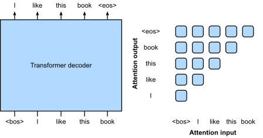]

.footnote[Джерело: [Dive Into Deep Learning](https://d2l.ai), 2023.]
  
---

class: middle, center

([demo](https://poloclub.github.io/transformer-explainer/))

---

class: middle

Historically, GPT-1 was first pre-trained and then fine-tuned on downstream tasks.

.width-100[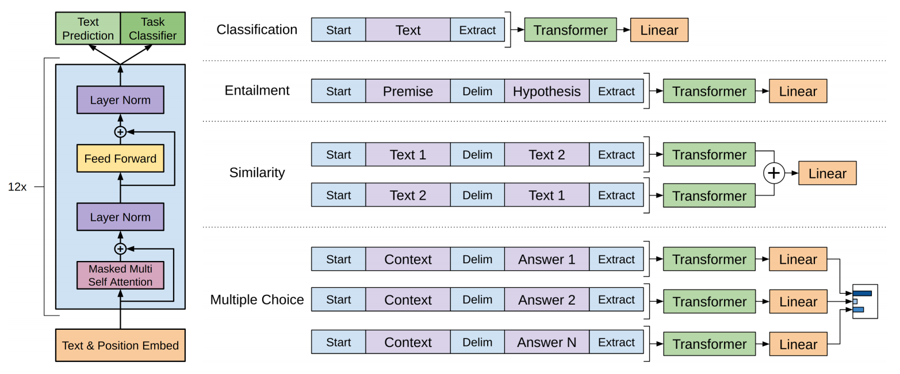]

.footnote[Джерело: Radford et al., [Improving Language Understanding by Generative Pre-Training](https://cdn.openai.com/research-covers/language-unsupervised/language_understanding_paper.pdf), 2018.]

---

class: middle

## Scaling laws

Transformer language model performance improves smoothly as we increase the model size, the dataset size, and amount of compute used for training. 

For optimal performance, all three factors must be scaled up in tandem. Empirical performance has a power-law relationship with each individual factor when not bottlenecked by the other two.

.center.width-100[]

.footnote[Джерело: [Kaplan et al](https://arxiv.org/pdf/2001.08361.pdf), 2020.]

---

class: middle

Large models also enjoy better sample efficiency than small models.
- Larger models require less data to achieve the same performance.
- The optimal model size shows to grow smoothly with the amount of compute available for training.

 
.center.width-100[]

.footnote[Джерело: [Kaplan et al](https://arxiv.org/pdf/2001.08361.pdf), 2020.]

---

class: middle

## Conversational agents

.center.width-70[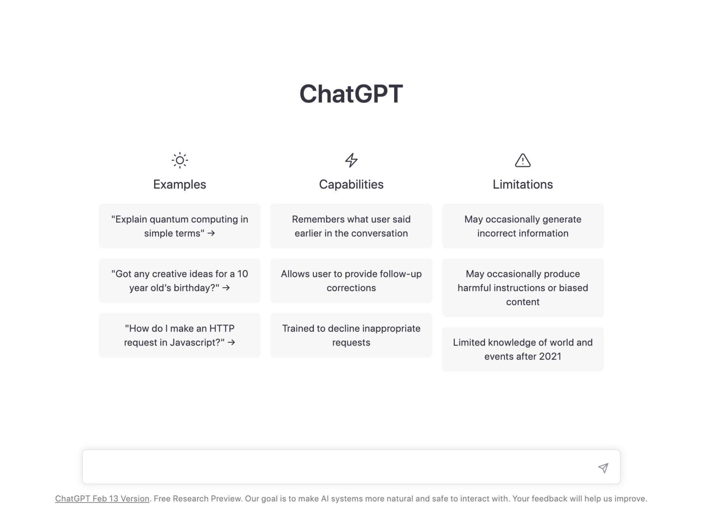]

All modern conversational agents are based on the same transformer models, scaled up to billions of parameters, trillions of training tokens, and thousands of petaflop/s-days of compute.

---

class: middle
count: false

# Transformers for images

---

class: middle

The transformer architecture was first designed for sequences, but it can be adapted to process images.

The key idea is to reshape the input image into a sequence of patches, which are then processed by a transformer encoder. This architecture is known as the .bold[vision transformer] (ViT).

---

class: middle

.center.width-80[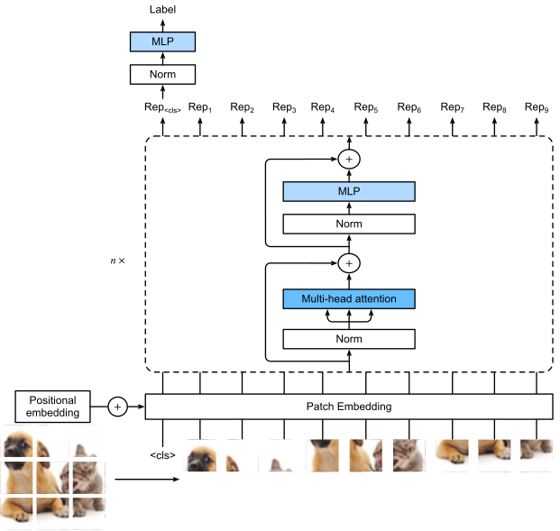]

.footnote[Джерело: [Dive Into Deep Learning](https://d2l.ai), 2023.]

---

class: middle

- The input image is divided into non-overlapping patches, which are then linearly embedded into a sequence of vectors.
- The sequence of vectors is then processed by a transformer encoder, which outputs a sequence of vectors.
- Training the vision transformer can be done with supervised or self-supervised learning.
  
---

class: end-slide, center
count: false

.larger-xxxx[🏁]
